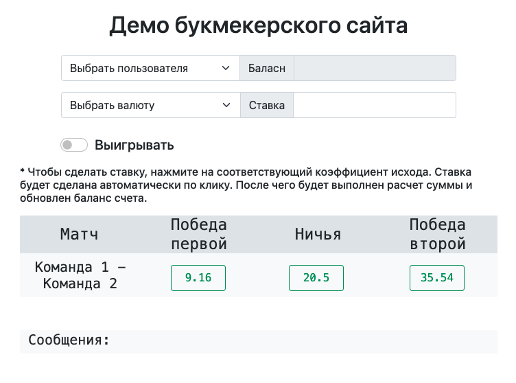
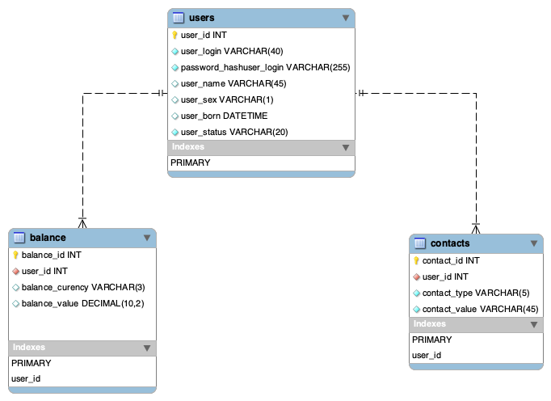

# Тестовое задание Saule IT
Система позволяет хранить информацию о пользователях и их текущем денежном балансе. 
Пользователь может делать ставки на исходы и получать выигрыш на счет. Исходу соответствует
определенный коэффициент.

### Реализация
Проект представляет из себя простую реализацию MVC. Для обмена между клиентом и сервером реализован REST API.

### Поддерживаемы методы
##### GET Получить список всех пользователей
```js
/api/users/action/list
```

##### GET Получить информацию о конкретном пользователе
```js
/api/users/{id}/action/info
```

##### GET Получить баланс пользователя
```js
/api/users/{id}/action/balance/usd
/api/users/{id}/action/balance/eur
/api/users/{id}/action/balance/rub
```

##### PUT сделать ставку
```js
/api/users/{id}/action/bet/
```


### Как установить
* У вас должен быть установлен докер
* Убедитесть, что другие контейнеры не занимаю порты 8080 и 8000

Чтобы задеплоить проект выполните в командной строке
```bash
git clone https://github.com/kolotov/sports-betting.git

cd sports-betting

# запускает процесс установки
make run
```

### Демо страница

После установки проекта, ознакомительная страница будет доступена по адресу http://localhost:8080/

На ней можно сделать ставку выбрав соответствующий коэффициент исхода и нажав кнопку "Сделать ставку". После чего будет выполнен расчет суммы и обновлен баланс счета. 




### База данных
Ознакомиться с базой данных можно здесь после установки проекта: phpMyadmin http://localhost:8000/

```
SERVER db
LOGIN root
PASSWORD mysql
```

Также доступен дам с базой данных
BD dump https://github.com/kolotov/sports-betting/blob/master/config/init.sql





